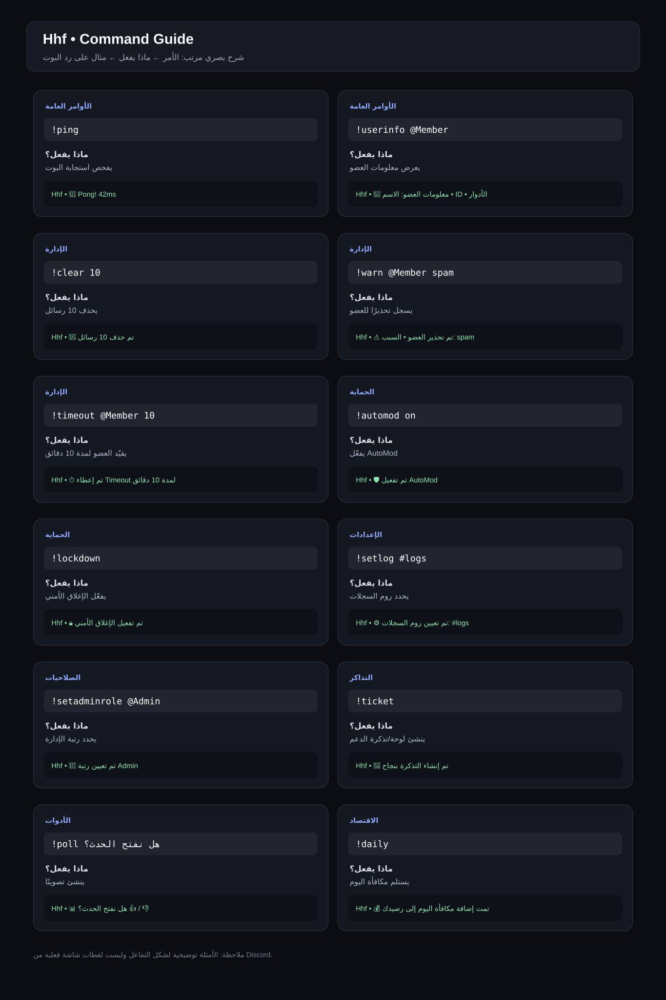

# Hhf — دليل الأوامر

هذا الدليل مرتب كمرجع سريع: **الأمر → وظيفته → مثال الاستخدام → شكل الرد المتوقع**.  
الصور التالية مصممة بأسلوب واجهة دردشة Discord لتوضيح طريقة التفاعل، وليست لقطات شاشة فعلية.

## 🖼️ دليل بصري سريع

---

## 📌 1) الأوامر العامة

| الأمر | ماذا يفعل؟ | مثال |
|---|---|---|
| `!help` | يعرض قائمة المساعدة والأوامر | `!help` |
| `!ping` | يفحص استجابة البوت | `!ping` |
| `!uptime` | يعرض مدة تشغيل البوت | `!uptime` |
| `!botinfo` | يعرض معلومات Hhf | `!botinfo` |
| `!server` | يعرض معلومات السيرفر | `!server` |
| `!userinfo [@عضو]` | يعرض معلومات عضو | `!userinfo @Member` |
| `!avatar [@عضو]` | يعرض صورة العضو | `!avatar @Member` |
| `!rolelist` | يعرض رتب السيرفر | `!rolelist` |
| `!channels` | يعرض قنوات السيرفر | `!channels` |
| `!icon` | يعرض أيقونة السيرفر | `!icon` |
| `!serverstats` | يعرض إحصائيات السيرفر | `!serverstats` |

---

## 🛡️ 2) الإدارة والمودريشن

| الأمر | الوظيفة | مثال |
|---|---|---|
| `!clear <عدد>` | حذف عدد من الرسائل | `!clear 10` |
| `!kick @عضو [سبب]` | طرد عضو | `!kick @Member spam` |
| `!ban @عضو [سبب]` | حظر عضو | `!ban @Member raid` |
| `!unban <ID>` | إزالة الحظر عن ID | `!unban 123456789` |
| `!timeout @عضو <دقائق> [سبب]` | تقييد عضو لمدة محددة | `!timeout @Member 10 spam` |
| `!untimeout @عضو` | إزالة الـ Timeout | `!untimeout @Member` |
| `!warn @عضو [سبب]` | إضافة تحذير | `!warn @Member spam` |
| `!warnings [@عضو]` | عرض التحذيرات | `!warnings @Member` |
| `!unwarn @عضو <رقم>` | إزالة تحذير محدد | `!unwarn @Member 1` |
| `!lock` | قفل القناة | `!lock` |
| `!unlock` | فتح القناة | `!unlock` |
| `!slowmode <ثواني>` | ضبط Slowmode | `!slowmode 10` |

---

## 🔐 3) الحماية

| الأمر | الوظيفة | مثال |
|---|---|---|
| `!automod on/off` | تشغيل أو إيقاف AutoMod | `!automod on` |
| `!antilink on/off` | التحكم بمنع الروابط | `!antilink on` |
| `!antispam on/off` | التحكم بمكافحة السبام | `!antispam on` |
| `!lockdown` | تفعيل الإغلاق الأمني | `!lockdown` |
| `!unlockdown` | إلغاء الإغلاق الأمني | `!unlockdown` |
| `!protection` | عرض/إدارة إعدادات الحماية | `!protection` |

---

## 🎫 4) التذاكر

| الأمر | الوظيفة | مثال |
|---|---|---|
| `!ticket` | إنشاء نظام/لوحة التذاكر | `!ticket` |
| `!close` | إغلاق التذكرة الحالية | `!close` |

**داخل التذكرة:** يوجد أيضًا زر **إغلاق التذكرة** لتسهيل الإغلاق بدون كتابة أمر.

---

## ⚙️ 5) الإعدادات والصلاحيات

| الأمر | الوظيفة | مثال |
|---|---|---|
| `!setlog #روم` | تحديد قناة السجلات | `!setlog #logs` |
| `!setwelcome #روم` | تحديد قناة الترحيب | `!setwelcome #welcome` |
| `!welcome_msg <النص>` | تغيير رسالة الترحيب | `!welcome_msg أهلاً بك!` |
| `!setsuggest #روم` | تحديد قناة الاقتراحات | `!setsuggest #suggestions` |
| `!setcategory #تصنيف` | تحديد تصنيف التذاكر | `!setcategory #Tickets` |
| `!config` | عرض إعدادات السيرفر | `!config` |
| `!setadminrole @Role` | تحديد رتبة الإدارة المخصصة | `!setadminrole @Admin` |
| `!setmodrole @Role` | تحديد رتبة المودريشن المخصصة | `!setmodrole @Moderator` |
| `!clearadminrole` | إزالة رتبة الإدارة المخصصة | `!clearadminrole` |
| `!clearmodrole` | إزالة رتبة المودريشن المخصصة | `!clearmodrole` |
| `!roles` | عرض حالة رتب الصلاحيات | `!roles` |

---

## 🔧 6) الأدوات

| الأمر | الوظيفة | مثال |
|---|---|---|
| `!say <النص>` | يرسل نصًا باسم البوت | `!say أهلاً بالجميع` |
| `!announce <النص>` | يرسل إعلانًا منسقًا | `!announce موعد الحدث اليوم` |
| `!poll <السؤال>` | إنشاء تصويت | `!poll هل نفتح الحدث؟` |
| `!suggest <الاقتراح>` | إرسال اقتراح | `!suggest إضافة أمر جديد` |
| `!createchannel <الاسم>` | إنشاء قناة | `!createchannel general` |
| `!deletechannel` | حذف القناة الحالية | `!deletechannel` |

---

## 🏆 7) المستويات والاقتصاد والرتب

| الأمر | الوظيفة | مثال |
|---|---|---|
| `!rank [@عضو]` | عرض المستوى/الرتبة | `!rank @Member` |
| `!balance [@عضو]` | عرض الرصيد | `!balance @Member` |
| `!daily` | استلام مكافأة يومية | `!daily` |
| `!work` | تنفيذ العمل والحصول على مكافأة | `!work` |
| `!leaderboard` | عرض المتصدرين | `!leaderboard` |
| `!autorole @Role` | تحديد الرتبة التلقائية | `!autorole @Member` |
| `!autorole_off` | إيقاف الرتبة التلقائية | `!autorole_off` |
| `!addrole @عضو @Role` | إعطاء رتبة لعضو | `!addrole @Member @VIP` |
| `!removerole @عضو @Role` | إزالة رتبة من عضو | `!removerole @Member @VIP` |
| `!slowclear <عدد>` | حذف رسائل بطريقة متدرجة | `!slowclear 20` |
| `!membercount` | عرض عدد الأعضاء | `!membercount` |

---

## 🛡️ 8) الحماية المتقدمة

الأوامر الموجودة في نظام الحماية أيضًا:

- `!lockdown` — إغلاق أمني للسيرفر.
- `!unlockdown` — إلغاء الإغلاق الأمني.
- `!protection` — عرض/إدارة نظام الحماية.
- نظام الحماية يشمل حماية القنوات والرتب ومراقبة بعض أنشطة الـRaid/Nuke وفق إعدادات المشروع.

---

## 🧩 9) الأوامر المولدة

يوجد **10,000 أمر مولد فعليًا** من:

`!cmd00001` → `!cmd10000`

كل أمر مولد ينتمي إلى إحدى الفئات الموجودة في `mass_commands.py`، ويعيد Embed يوضح رقم الأمر وتصنيفه وبعض بيانات السيرفر.

---

## 👑 10) مستويات الوصول

- **Owner / Administrator:** يتجاوز فحص رتبة Hhf المخصصة.
- **Admin:** أوامر الإعدادات الإدارية المخصصة.
- **Moderator:** أوامر المودريشن، مع السماح لرتبة Admin باستخدامها.
- **Member:** الأوامر العامة التي لا تحتاج صلاحية خاصة.
- عند عدم ضبط رتبة مخصصة، تبقى فحوصات صلاحيات Discord الأصلية هي المرجع للأوامر التي تتطلب صلاحيات.

### طريقة قراءة أي أمر

`!command <مطلوب>`  
- ما بين `< >` = قيمة يجب إدخالها.
- ما بين `[ ]` = قيمة اختيارية.
- `@عضو` = منشن العضو.
- `#روم` = منشن القناة.
- `<ID>` = رقم Discord ID.

> **ملاحظة:** الصور توضيحية لشرح طريقة التفاعل وليست لقطات شاشة فعلية من Discord.
