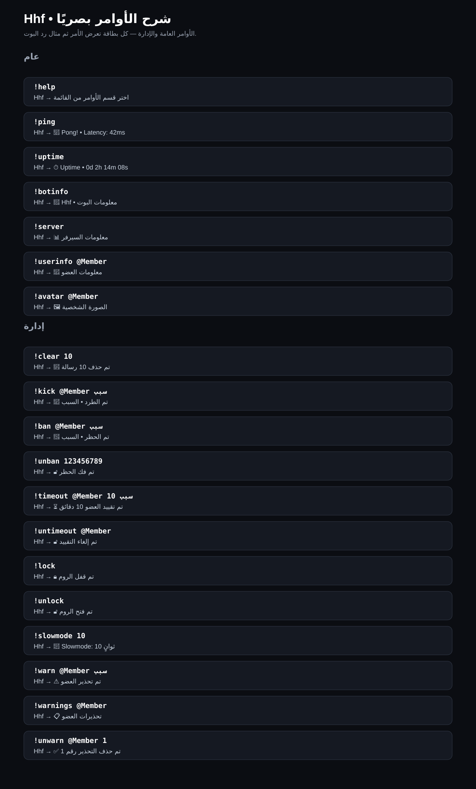
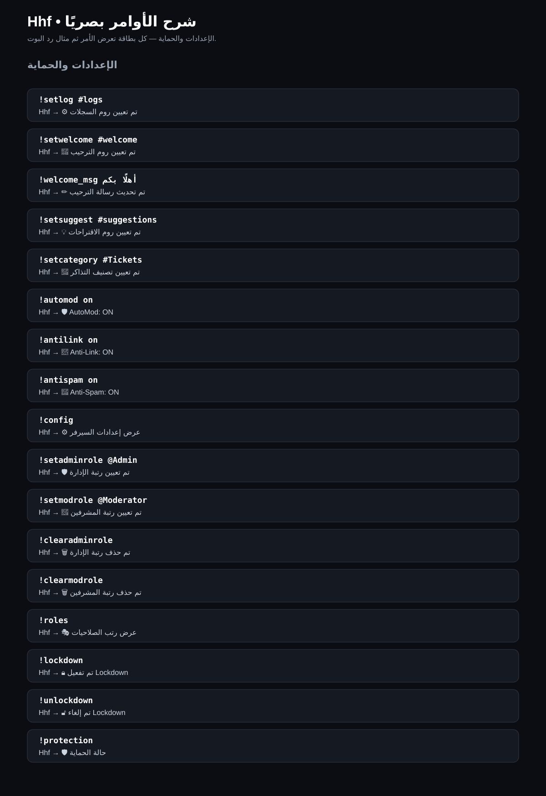
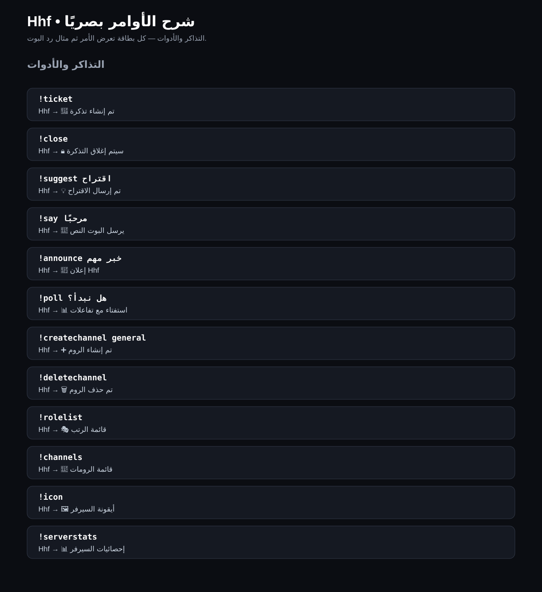
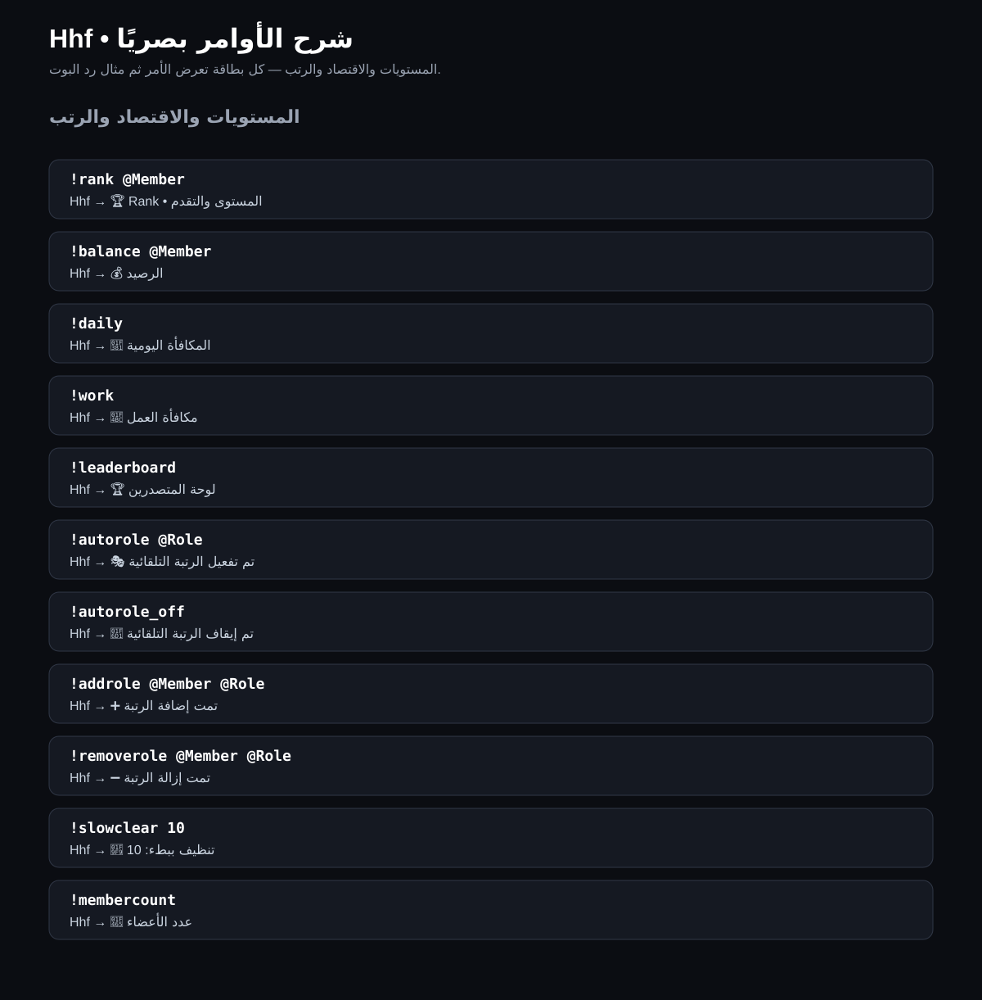

# Hhf Commands

هذا الملف يشرح **كل الأوامر اليدوية الموجودة في Hhf** بصريًا: كل بطاقة تعرض الأمر كما يكتبه المستخدم ثم مثالًا لشكل رد البوت.

## 🖼️ الصور التوضيحية

### الأوامر العامة + الإدارة

### الإعدادات + الحماية + الصلاحيات

### التذاكر + الأدوات

### المستويات + الاقتصاد + الرتب

## 📌 الأوامر العامة
`!help` • `!ping` • `!uptime` • `!botinfo` • `!server` • `!userinfo [@عضو]` • `!avatar [@عضو]` • `!rolelist` • `!channels` • `!icon` • `!serverstats`

## 🛡️ الإدارة
`!clear <عدد>` • `!kick @عضو [سبب]` • `!ban @عضو [سبب]` • `!unban <ID>` • `!timeout @عضو <دقائق> [سبب]` • `!untimeout @عضو` • `!warn @عضو [سبب]` • `!warnings [@عضو]` • `!unwarn @عضو <رقم>` • `!lock` • `!unlock` • `!slowmode <ثواني>`

## 🔐 الحماية
`!automod on/off` • `!antilink on/off` • `!antispam on/off` • `!lockdown` • `!unlockdown` • `!protection`

## 🎫 التذاكر
`!ticket` • `!close`  
داخل التذكرة يوجد أيضًا زر **إغلاق التذكرة**.

## ⚙️ الإعدادات والصلاحيات
`!setlog #روم` • `!setwelcome #روم` • `!welcome_msg <النص>` • `!setsuggest #روم` • `!setcategory #تصنيف` • `!config` • `!setadminrole @Role` • `!setmodrole @Role` • `!clearadminrole` • `!clearmodrole` • `!roles`

## 🔧 الأدوات
`!say <النص>` • `!announce <النص>` • `!poll <السؤال>` • `!suggest <الاقتراح>` • `!createchannel <الاسم>` • `!deletechannel`

## 🏆 المستويات والاقتصاد والرتب
`!rank [@عضو]` • `!balance [@عضو]` • `!daily` • `!work` • `!leaderboard` • `!autorole @Role` • `!autorole_off` • `!addrole @عضو @Role` • `!removerole @عضو @Role` • `!slowclear <عدد>` • `!membercount`

## 🧩 الأوامر المولدة
Hhf يحتوي أيضًا على **10,000 أمر مولد حقيقي** من `!cmd00001` إلى `!cmd10000`. كل واحد منها يعمل ويرسل Embed يوضح رقمه وتصنيفه وبيانات السيرفر.

## 👑 مستويات الوصول
- **Owner / Administrator:** أعلى مستوى وصول.
- **Admin:** أوامر الإعدادات المخصصة.
- **Moderator:** أوامر المودريشن.
- **Member:** الأوامر العامة.
- صلاحيات Discord الأصلية تبقى مطبقة أيضًا على الأوامر التي تتطلب صلاحيات Discord.

> ملاحظة: الصور **تصاميم توضيحية** لشكل التفاعل وليست لقطات شاشة فعلية من Discord.
